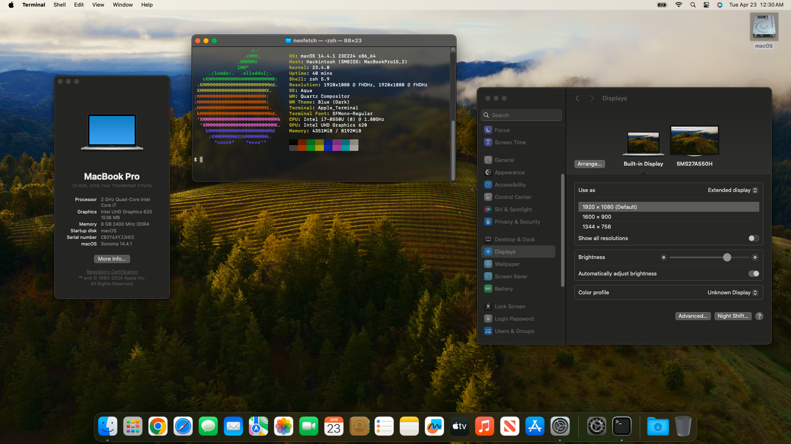

# Asus-S510UA-DS71-Hackintosh (macOS 14)
**Hackintosh Installation Guide for Asus VivoBook S10UA-DS71 and macOS 14.4.1 "Sonoma"**

Please consider [donating](https://paypal.me/djouija) to support this project. Thanks!

## Hardware Specs
- Intel Core i7-8550U [Kaby Lake Refresh] Processor 1.8 GHz (Turbo up to 4.0 GHz)
- Intel UHD Graphics 620
- Intel Dual Band Wireless-AC 8265
- Conexant Audio CX8050
- Realtek Card Reader (RTL8411B_RTS5226_RTS5227)
- ELAN 1300 Trackpad

## Preface
**This guide is a <u>work in progress</u> and will be updated accordingly.**

After a long hiatus from the hackintosh scene, I'm back in action wasting time trying to get this awful operating system running on this unit again for development purposes.

I've _finally_ managed to get OpenCore running on this machine, after running into nothing but issues with macOS installer failing to load / kernel panic when following other **Kaby Lake** based configurations and examples.  After finally getting the macOS installer to load when trying a prebuilt package for **Cofeee Lake** instead, I realized that both `CpuTscSync.kext` and `TSC_sync_margin=0` boot arg are needed to resolve this!

## Quick Installation Notes

- Built the macOS USB installer using [OCLP](https://dortania.github.io/OpenCore-Legacy-Patcher/INSTALLER.html) for macOS Sonoma 14.4.1
	-  _Note this now requires a USB **larger than** 16GB!_
- Based my initial OpenCore USB installer EFI off the [OpenCore NoteBook KabyLake](https://olarila.com/files/OPENCORE1/EFI.Opencore.NoteBook.KabyLake.zip) prebuilt package available from [olarila.com](https://www.olarila.com/topic/5676-hackintosh-efi-folder-with-clover-and-opencore/)   _(thank you to [@MaLd0n](https://github.com/MaLd0n))_
> [!NOTE]
> **You have to add [CpuTscSync.kext](https://github.com/acidanthera/CpuTscSync/releases)  and `TSC_sync_margin=0` boot arg or macOS will fail to load!**

- After successful install, then copied EFI folder to internal EFI partition and [generated SMBIOS](https://github.com/corpnewt/GenSMBIOS) for `MacBookPro15,2`
- Removed `MaLd0n.aml` file from prebuilt EFI and generated proper ACPI for Kaby Lake and OpenCore _(as per [dortania](https://dortania.github.io/OpenCore-Install-Guide/config-laptop.plist/kaby-lake.html) guide)_ using [SSDTTime](https://github.com/corpnewt/SSDTTime) _[under Windows]_ to dump DSDT and ran patches: `FixHPET`, `FakeEC Laptop`, `PluginType`, `PNLF`, `XOSI`, and `Fix DMAR`
- Generate USB Mapping via [USBToolBox](https://github.com/USBToolBox/tool/releases) _[under Windows]_ and replaced `USBInjectAll.kext` with generated `UTBMap.kext` and 
	- _Note this will fix issues with sleep!_
- Modified OpenCore `config.plist` and tweaked some values the olarila.com prebuilt EFI folder came with: 
	- Modificed the `DeviceProperties` for `PciRoot(0x0)/Pci(0x2,0x0)` aka the Intel UHD 620 IGPU; See table below.
		- This enables proper graphics accelleration/frame buffer with external HDMI output, 4095MB VRAM, and Metal 3 support.
	- Changed AppleALC boot arg from `alcid=3` to instead use `alcid=13` to better match Conexant Audio CX8050 which also enables internal microphone
	- Enabled wifi support for the Intel Dual Band Wireless-AC 8265 via the [itlwm 2.3.0-alpha version](https://github.com/OpenIntelWireless/itlwm/releases/tag/v2.3.0-alpha) kext.
		- _Debating if I should set country code via `itlwm_cc=` boot arg_
	- Added [GPRW Instant Wake Patch](https://dortania.github.io/OpenCore-Post-Install/usb/misc/instant-wake.html) to improve sleep
		-  _Not completely certain if necessary but think sleep had issues if/when USB memory stick mounted when sleeping, and think this seems to help_
	- Added [Wake Property](https://dortania.github.io/OpenCore-Post-Install/usb/misc/keyboard.html#method-1-add-wake-type-property-recommended) and `SSDT-USBX.aml` [USB Power Fix](https://dortania.github.io/OpenCore-Post-Install/usb/misc/power.html) to OpenCore config
		- Wake from external USB keyboard/mouse still not working. 
	- Modified OC to use [BsxDarkFenceLight1](https://github.com/blackosx/BsxDarkFenceLight1) theme
	- Update kexts via [kextupdater](https://github.com/MacThings/kextupdater)
	- _(Optional)_ Configured OpenCore to boot Linix via [OpenLinuxBoot](OpenLinuxBoot) method
	- _Todo:_ Install and enable [AsusSMC](https://github.com/hieplpvip/AsusSMC) -- follow here for [SSDT patching](https://github.com/hieplpvip/AsusSMC/issues/93) related to this
	- _Note:_ As per [this](https://dortania.github.io/OpenCore-Post-Install/universal/sleep.html#fixing-gpus) the `forceRenderStandby=0` boot arg may be needed if kernel panic on sleep occurs; Noticed that `-noDC9` boot arg is present in the Coffee Lake prebuilt EFI, not sure if needed but making note of it here.
	- Whatevergreen `igfxfw=2` boot arg causes [failure when loading IGPU firmware](https://elitemacx86.com/threads/how-to-improve-igpu-performance-intel-graphics-on-macos.1059/), do not use!
	- Whatevergreen `-igfxblr -igfxblt` boot arg will break brightness slider, do not use!
	- Debating if `-igfxbls` makes any difference in backlight smoothness
	- Still tweaking and improving, will update here accordingly.

## DeviceProperties

The following tables display the added PCI devices and their child keys.

### PciRoot(0x0)/Pci(0x2,0x0)

Intel UHD 620 Graphics

| **Key**                  | **Type** |   **Value**  |
|--------------------------|:--------:|:------------:|
| AAPL,ig-platform-id      |   Data   | ``00001B59`` |
| device-id                |   Data   | ``16590000`` |
| framebuffer-con1-alldata |   Data   | ``01050A00 00080000 87010000 02040A00 00080000 87010000 FF000000 01000000 20000000`` |
| framebuffer-con1-enable  |   Data   | ``01000000`` |
| framebuffer-con2-enable  |   Data   | ``01050A00 00080000 87010000 03060A00 00040000 87010000 FF000000 01000000 20000000 `` |
| framebuffer-fbmem        |   Data   | ``00009000`` |
| framebuffer-patch-enable |   Data   | ``01000000`` |
| framebuffer-stolenmem    |   Data   | ``00003001`` |
| framebuffer-unifiedmem   |   Data   | ``FFFFFFFF`` |
| enable-metal             |   Data   | ``01000000`` |
