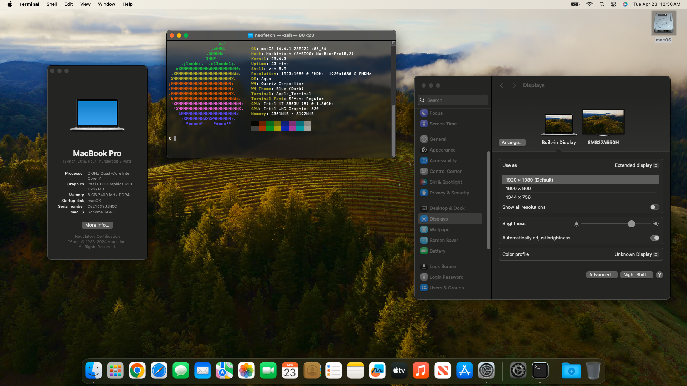

# Asus-S510UA-DS71-Hackintosh (macOS 14)
**Hackintosh Installation Guide for Asus VivoBook S10UA-DS71 and macOS 14.4.1 "Sonoma"**

Please consider [donating](https://paypal.me/djouija) to support this project. Thanks!

## Hardware Specs
- Intel Core i7-8550U [Kaby Lake Refresh] Processor 1.8 GHz (Turbo up to 4.0 GHz)
- Intel UHD Graphics 620
- Intel Dual Band Wireless-AC 8265
- Conexant Audio CX8050
- Realtek Card Reader (RTL8411B_RTS5226_RTS5227)
- ELAN 1300 Trackpad

## Preface
**This guide is a <u>work in progress</u> and will be updated accordingly.**

> [!NOTE]
> _This system is **fully functional** now running Sonoma 14.4.1, and I'm beginning to put it through it's paces to find out where the ghosts in the machine are!_

After a long hiatus from the hackintosh scene, I'm back in action wasting time trying to get this awful operating system running on this unit again for development purposes.

I've _finally_ managed to get OpenCore running on this machine, after running into nothing but issues with macOS installer failing to load / kernel panic when following other **Kaby Lake** based configurations and examples.  After finally getting the macOS installer to load when trying a prebuilt package for **Cofeee Lake** instead, I realized that both `CpuTscSync.kext` and `TSC_sync_margin=0` boot arg are needed to resolve this!

## Pre Installation Notes

- Built the macOS USB installer using [OCLP](https://dortania.github.io/OpenCore-Legacy-Patcher/INSTALLER.html) for macOS Sonoma 14.4.1
	-  _Note this now requires a USB **larger than** 16GB!_
- Based my initial OpenCore USB installer EFI off the [OpenCore NoteBook KabyLake](https://olarila.com/files/OPENCORE1/EFI.Opencore.NoteBook.KabyLake.zip) prebuilt package available from [olarila.com](https://www.olarila.com/topic/5676-hackintosh-efi-folder-with-clover-and-opencore/)   _(thank you to [@MaLd0n](https://github.com/MaLd0n))_
> [!CAUTION]
> **You have to add [CpuTscSync.kext](https://github.com/acidanthera/CpuTscSync/releases)  and `TSC_sync_margin=0` boot arg or macOS will fail to load!**

## Post Installation Notes

- After successful install, then copied EFI folder to internal EFI partition and [generated SMBIOS](https://github.com/corpnewt/GenSMBIOS) for `MacBookPro15,2`
- Removed `MaLd0n.aml` file from prebuilt EFI and generated proper ACPI for Kaby Lake and OpenCore _(as per [dortania](https://dortania.github.io/OpenCore-Install-Guide/config-laptop.plist/kaby-lake.html) guide)_ using [SSDTTime](https://github.com/corpnewt/SSDTTime) _[under Windows]_ to dump DSDT and ran patches: `FixHPET`, `FakeEC Laptop`, `PluginType`, `PNLF`, `XOSI`, and `Fix DMAR`
- Generate USB Mapping via [USBToolBox](https://github.com/USBToolBox/tool/releases) _[under Windows]_ and replaced `USBInjectAll.kext` with generated `UTBMap.kext` and [USBToolBox.kext](https://github.com/USBToolBox/kext)
	- _Note you need to insert SD card into reader during USB mapping or SD card reader will fail to function! (in relation to [Sinetek-rtsx.kext](https://github.com/cholonam/Sinetek-rtsx/releases))_
	- _You should also insert a [USB3.0] device into every port during mapping, including USB-C port!_
	- _Also note this will help fix issues with sleep!_

> [!WARNING]  
> If using [OpenCore Configurator](https://mackie100projects.altervista.org/download-opencore-configurator/) to modify your `config.plist`, be aware that the `Check Kexts` button/option under the `Kernel -> Add` section has the potential to *break* your config and cause kexts to fail to load for some reason.  **Avoid using this to prevent headaches!**
	
- Modified OpenCore `config.plist` and tweaked some values the olarila.com prebuilt EFI folder came with:
	- Modificed the `DeviceProperties` for `PciRoot(0x0)/Pci(0x2,0x0)` aka the Intel UHD 620 IGPU; See table below.
		- This enables proper graphics accelleration/frame buffer with external HDMI output, 4095MB VRAM, and Metal 3 support.
	- Changed AppleALC boot arg from `alcid=3` to instead use `alcid=13` to better match Conexant Audio CX8050 which also enables internal microphone
	- Enabled wifi support for the Intel Dual Band Wireless-AC 8265 via the [itlwm 2.3.0-alpha version](https://github.com/OpenIntelWireless/itlwm/releases/tag/v2.3.0-alpha) kext.
		- _Debating if I should set country code via `itlwm_cc=` boot arg_
	- Enabled bluetooth support for the Intel Dual Band Wireless-AC 8265 via the [IntelBluetoothFirmware](https://github.com/OpenIntelWireless/IntelBluetoothFirmware/) package and only added `IntelBTPatcher.kext` and `IntelBluetoothFirmware.kext` along with the `BlueToolFixup.kext` from [acidanthera/BrcmPatchRAM](https://github.com/acidanthera/BrcmPatchRAM/releases) _(as per these [instructions](https://openintelwireless.github.io/IntelBluetoothFirmware/FAQ.html#what-additional-steps-should-i-do-to-make-bluetooth-work-on-macos-monterey-and-newer))_
	- Enabled Realtek Card Reader via [Sinetek-rtsx.kext](https://github.com/cholonam/Sinetek-rtsx/releases)
		- _Note you need to insert SD card into reader during USB mapping or SD card reader will fail to function if using `UTBMap.kext`/`USBToolBox.kext`_
	- Added [GPRW Instant Wake Patch](https://dortania.github.io/OpenCore-Post-Install/usb/misc/instant-wake.html) to improve sleep
		-  _Not certain if necessary but think sleep had issues if/when USB memory stick mounted when sleeping, and think this seems to help_
	- Installed and enabled [AsusSMC.kext](https://github.com/hieplpvip/AsusSMC) to enable keyboard backlight LEDs
		- Requires additional [SSDT-KBL.aml](./macOS_14/Post-Install/SSDT/SSDT-KBL.aml) added to `config.plist` and `EFI/OC/ACPI` to enable
			- This is a custom SSDT that I developed based off a combination of the [[kbl] Kaby Lake/Kaby Lake-R](https://github.com/hieplpvip/AsusSMC/blob/master/patches/kbl_kabylake.txt) patch _and_ the [Fake ALS](https://github.com/hieplpvip/AsusSMC/blob/master/patches/fake_als.txt) patch available on the AsusSMC repo _(both are required for keyboard backlight to illuminate)_
			- No additional function key patches were added; Use in conjunction with [BrightnessKeys.kext](https://github.com/acidanthera/BrightnessKeys/releases), [VirtualSMC](https://github.com/acidanthera/VirtualSMC/releases), and the `SSDT-PNLF.aml` generated by SSDTTime.
			- Note that the `SMCLightSensor.kext` should <ins>not</ins> be installed/enabled as it is unnecessary and might conflict with AsusSMC and the `Fake ALS` patch.
			- Gained insight for this SSDT patching from [here](https://github.com/hieplpvip/AsusSMC/issues/93)
	- Added [Wake Property](https://dortania.github.io/OpenCore-Post-Install/usb/misc/keyboard.html#method-1-add-wake-type-property-recommended) and `SSDT-USBX.aml` [USB Power Fix](https://dortania.github.io/OpenCore-Post-Install/usb/misc/power.html) to OpenCore config
		- Wake from external USB keyboard/mouse still not working. 
	- Modified OC to use [BsxDarkFenceLight1](https://github.com/blackosx/BsxDarkFenceLight1) theme
	- Update kexts via [kextupdater](https://github.com/MacThings/kextupdater)
	- _(Optional)_ Configured OpenCore to boot Linix via [OpenLinuxBoot](OpenLinuxBoot) method

## Updating OpenCore (0.9.9 → 1.0.7)

Updated OpenCore from `0.9.9` to [1.0.7](https://github.com/acidanthera/OpenCorePkg/releases/tag/1.0.7) while still on Sonoma 14.4.1, in preparation for upgrading to macOS Tahoe _(which requires OpenCore **1.0.5 or newer**)_.

> [!IMPORTANT]
> Back up your working `EFI/OC` folder first!  I kept one copy on the Mac and a second copy on the EFI partition itself (`EFI/OC-0.9.9-backup`) so it can be restored from Windows/Linux if macOS fails to boot.

- Downloaded the `OpenCore-1.0.7-RELEASE.zip` and from `X64/EFI/OC` replaced:
	- `OpenCore.efi`
	- `Drivers/OpenRuntime.efi`, `Drivers/OpenCanopy.efi`, `Drivers/OpenLinuxBoot.efi`, `Drivers/ResetNvramEntry.efi`
	- Replaced the old `Drivers/ext4_x64.efi` with `Drivers/Ext4Dxe.efi` _(renamed in newer OpenCore)_ and updated the path under `UEFI -> Drivers` in `config.plist`
	- `HfsPlus.efi` is <ins>not</ins> part of the OpenCore package _(from [OcBinaryData](https://github.com/acidanthera/OcBinaryData))_ so left as-is, along with kexts, ACPI and theme resources.
- Ran the matching `Utilities/ocvalidate/ocvalidate` against `config.plist`, which reported two missing keys that were added with default values:
	- `Booter -> Quirks -> ClearTaskSwitchBit` = `False` _(Boolean)_
	- `UEFI -> Unload` = empty _(Array)_
- Re-ran `ocvalidate` with no issues found, then copied the updated files to the EFI partition and rebooted.
- Verify the new version after booting via: `nvram 4D1FDA02-38C7-4A6A-9CC6-4BCCA8B30102:opencore-version` _(should return `REL-107-2026-03-20`)_
- Also updated `BlueToolFixup.kext` to `2.7.2`; all other kexts were already at their latest releases.

> [!NOTE]
> On this machine `EFI/BOOT/BOOTx64.efi` is the Ubuntu shim _(not OpenCore)_ since the BIOS boots `EFI/OC/OpenCore.efi` directly, so it was left untouched.  If your `BOOTx64.efi` _is_ OpenCore's, replace it with the one from `X64/EFI/BOOT` as well.

## Upgrading to macOS Sequoia (15.8)

### Why Sequoia and not Tahoe?

Originally planned to go to macOS Tahoe 26.7 _(the final Intel release)_, but decided against it for this machine:

- `AppleHDA.kext` was **removed** in Tahoe, so AppleALC no longer works for the Conexant CX8050.  Audio would require either [re-injecting AppleHDA](https://github.com/perez987/AppleHDA-back-on-macOS-26-Tahoe) into the system volume _(redone after every macOS update)_ or VoodooHDA.
- The Kaby Lake (KBL) graphics drivers were present in the Tahoe betas, and reports suggest UHD 620 acceleration still works on Tahoe with current Lilu/WhateverGreen, but this has <ins>not</ins> been tested on this machine.
- Intel wifi requires `itlwm` + HeliPort either way; the [AirportItlwm-Tahoe](https://github.com/kgp-macPro/AirportItlwm-Tahoe) fork needs OCLP root patches and is only qualified on the AX210.

On Sequoia, both AppleHDA _(AppleALC audio)_ and the KBL graphics drivers are still native.

### SMBIOS

`MacBookPro15,2` is not supported by Tahoe, so switched to **`MacBookPro16,2`** _(13-inch, 2020, Four Thunderbolt 3 Ports)_ which is supported by both Sequoia and Tahoe.

- **Sign out of iMessage, FaceTime and iCloud first!**
- Generated new `SystemSerialNumber`, `MLB` and `SystemUUID` using `macserial` from the OpenCore package: `macserial -m MacBookPro16,2 -g -n 6`
	- Check each serial at [checkcoverage.apple.com](https://checkcoverage.apple.com) and use one that reports **"Please enter a valid serial number"**.  _(The first one I generated belonged to a real MacBook Pro!)_
	- `ROM` was left unchanged.
- Performed a **Reset NVRAM** from the OpenCore picker after changing SMBIOS, and verified everything still worked under Sonoma before continuing.
- `UTBMap.kext` from USBToolBox matches on the `XHC` controller rather than the SMBIOS model, so the USB mapping did <ins>not</ins> need to be redone.

### Wifi and Bluetooth

`AirportItlwm` does <ins>not</ins> work natively on Sequoia or newer _(Apple removed the legacy wireless stack it depends on)_, so switched to [itlwm](https://github.com/OpenIntelWireless/itlwm/releases) with the [HeliPort](https://github.com/OpenIntelWireless/HeliPort/releases) client app instead.  Using `MinKernel`/`MaxKernel` lets the same EFI boot either OS with the correct kext:

| **Kext**            | **MinKernel** | **MaxKernel** | **Loads on** |
|---------------------|:-------------:|:-------------:|--------------|
| `AirportItlwm.kext` _(Sonoma 14.4 build)_ | | `23.99.99` | Sonoma |
| `itlwm.kext` _(v2.3.0)_ | `24.0.0` | | Sequoia and newer |

- Install **HeliPort** _before_ upgrading since there's no ethernet port on this laptop!  _(Have iPhone USB tethering or a USB ethernet adapter handy as a backup)_
- Added `-ibtcompatbeta` boot arg for `IntelBluetoothFirmware`/`IntelBTPatcher` on newer macOS.
- _Note: With itlwm + HeliPort, AirDrop, Continuity and native Wi-Fi menu features are unavailable._

### Other config changes

- Added `revpatch=sbvmm` boot arg _(uses the existing `RestrictEvents.kext`)_ so OTA updates still work with a T2-based SMBIOS and `SecureBootModel` set to `Disabled`.
- Boot args are now: `alcid=13 watchdog=0 igfxonln=1 agdpmod=vit9696 -vi2c-force-polling igfxagdc=0 -wegnoegpu -ibtcompatbeta revpatch=sbvmm`

### Installing

> [!NOTE]
> _Upgrade in progress; will update with results once running Sequoia._

- Downloaded the full installer via terminal: `softwareupdate --fetch-full-installer --full-installer-version 15.8`
	- _Use `softwareupdate --list-full-installers` to see available versions; these will <ins>only</ins> appear for your SMBIOS if it is supported._
- Run `Install macOS Sequoia` as an in-place upgrade over Sonoma, selecting `macOS Installer` in the OpenCore picker during reboots until it disappears.
- After first login, launch HeliPort to connect to wifi and add it to Login Items.

## General Notes

- The `forceRenderStandby=0` boot arg may be needed if kernel panic on sleep occurs _(as noted  [here](https://dortania.github.io/OpenCore-Post-Install/universal/sleep.html#fixing-gpus))_
-  Noticed that `-noDC9` boot arg is present in the Coffee Lake prebuilt EFI, <ins>not</ins> using currently or sure if needed but making note of it here.
- Whatevergreen `igfxfw=2` boot arg causes [failure when loading IGPU firmware](https://elitemacx86.com/threads/how-to-improve-igpu-performance-intel-graphics-on-macos.1059/), do <ins>not</ins> use!
- Whatevergreen `-igfxblr` and/or `-igfxblt` boot args will break brightness slider, do <ins>not</ins> use!
- Debating if `-igfxbls` makes any difference in display backlight smoothness, <ins>not</ins> using currently.
- Still tweaking and improving, will update here accordingly.

## DeviceProperties

The following tables display the added PCI devices and their child keys.

### PciRoot(0x0)/Pci(0x2,0x0)

Intel UHD 620 Graphics

| **Key**                  | **Type** |   **Value**  |
|--------------------------|:--------:|:------------:|
| AAPL,ig-platform-id      |   Data   | ``00001B59`` |
| device-id                |   Data   | ``16590000`` |
| framebuffer-con1-alldata |   Data   | ``01050A00 00080000 87010000 02040A00 00080000 87010000 FF000000 01000000 20000000`` |
| framebuffer-con1-enable  |   Data   | ``01000000`` |
| framebuffer-con2-enable  |   Data   | ``01050A00 00080000 87010000 03060A00 00040000 87010000 FF000000 01000000 20000000 `` |
| framebuffer-fbmem        |   Data   | ``00009000`` |
| framebuffer-patch-enable |   Data   | ``01000000`` |
| framebuffer-stolenmem    |   Data   | ``00003001`` |
| framebuffer-unifiedmem   |   Data   | ``FFFFFFFF`` |
| enable-metal             |   Data   | ``01000000`` |
