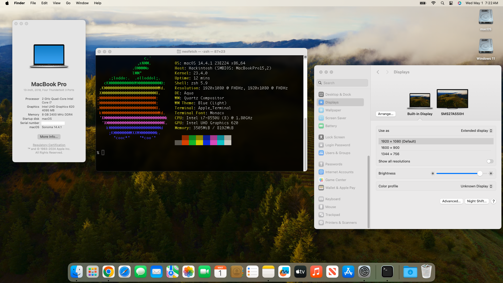

# Asus-S510UA-DS71-Hackintosh (macOS 14)
**Hackintosh Installation Guide for Asus VivoBook S10UA-DS71 and macOS 14.4.1 "Sonoma"**

Please consider [donating](https://paypal.me/djouija) to support this project. Thanks!

## Preface
###This guide is a work in progress and will be updated accordingly.

## Hardware Specs
- Intel Core i7-8550U [Kaby Lake Refresh] Processor 1.8 GHz (Turbo up to 4.0 GHz)
- Intel UHD Graphics 620
- Intel Dual Band Wireless-AC 8265
- Conexant Audio CX8050
- Realtek Card Reader (RTL8411B_RTS5226_RTS5227)
- ELAN 1300 Trackpad

## Quick Installation Notes

 More to come

