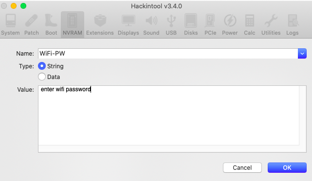

# Asus-S510UA-DS71-Hackintosh (macOS 10.15)
**Hackintosh Installation Guide for Asus VivoBook S10UA-DS71 and macOS 10.15 "Catalina"**
<p align="center" style="margin:0 auto !important;text-align:center !important;"></p>

Please consider [donating](https://paypal.me/djouija) to support this project. Thanks!

## Preface
**NOTE: This guide is <u>outdated</u> and is for archival purposes only.**

This unit was a bit of a stubborn bitch to hackintosh *(as it was my first Kaby Lake and Intel UHD 620 based model)* and prompted me to create this repo to track my installation and configuration steps for not only myself, but others as well.

This installation and guide was done in *May of 2020* using **macOS 10.15.5** and supports *ALL NATIVE HARDWARE*, including the OEM Intel WiFi card!

## Hardware Specs
- Intel Core i7-8550U [Kaby Lake Refresh] Processor 1.8 GHz (Turbo up to 4.0 GHz)
- Intel UHD Graphics 620
- Intel Dual Band Wireless-AC 8265
- Conexant Audio CX8050
- Realtek Card Reader (RTL8411B_RTS5226_RTS5227)
- ELAN 1300 Trackpad

## Quick Installation Notes

 1. Create macOS 10.15.5 Catalina USB Installer via [Vanilla Method](https://hackintosher.com/guides/how-to-make-a-macos-10-15-catalina-flash-drive-installer/) or [UniBeast](https://www.tonymacx86.com/resources/unibeast-10-1-0-catalina.469/) (EFI Method)
 2. Mount EFI partition of USB Installer *(using [Hackintool](https://github.com/headkaze/Hackintool/releases) or [Clover Configurator](https://mackie100projects.altervista.org/download-clover-configurator/) if necessary)*
 3. Replace the `EFI/CLOVER/config.plist` file with [the version from this repo](Installation/EFI/CLOVER/config.plist) *(see detailed installation notes  below regarding necessary modifications to this file to enable installation)*
 4. Copy/replace [these kexts](./Installation/EFI/CLOVER/kexts/Other) in the `/EFI/CLOVER/kexts/Other` folder
 5. Ensure BIOS has Display Memory set to 64MB and that both Secure Boot and CSM mode is disabled.
 6. Reboot and boot from USB and complete macOS installation! *(note that you need a usb mouse to complete installation)*


## Post-Installation Notes
 1. Install [Clover](https://github.com/CloverHackyColor/CloverBootloader/releases) to the macOS installation partition and choose `Customize` before installation and ensure that `Clover for UEFI booting only` is checked, along with `Install Clover in the ESP` and `UEFI Drivers -> Recommended drivers`,  as well as `File System drivers -> ApfsDriverLoader`, and also ensure that `Memory fix drivers -> AptioMemoryFix` 

*(Note that **OSXAptioFix3Drv** might be causing random `kernel panic "14=page fault"`on sleep *[hasn't occurred yet with `AptioMemoryFix` driver]* and **OSXAptioFixDrv** breaks NVRAM)*

You should also check off `Install Clover Preference Pane` to easily check for Clover Updates in the future from within System Preferences in macOS.

2. The `EFI` volume for this new macOS installation should still be mounted after installing Clover, so open it up and copy the contents of the [Clover post-installation folder](./Post-Install/CLOVER) from this repo to the `/EFI/CLOVER` folder *(replace any existing files if prompted)*

Note that [this post-installation folder](./Post-Install/CLOVER) contains **all** of the kexts, config settings, and DSDT modifications needed to get your `ASUS S510UA-DS71` up and running *beautifully*!

3. Now reboot and **open the BIOS boot menu** to select the macOS installation partition to boot Clover from.  

*Note:  If you **don't** see an entry in the BIOS boot menu for Clover on the macOS installation partition, you'll need to **manually create it** through the BIOS.* 

4. Once booted into MacOS, install [the driver package](./Post-Install/WiFi) for supporting the `Intel Dual Band Wireless-AC 8265` card by downloading [this file](./Post-Install/WiFi), extracting the contents and running the `install.command` file from the terminal under the directory you extracted the files to.  

Note: [This driver](http://bbs.pcbeta.com/viewthread-1848662-1-1.html) is still very experimental at the time and there are [a few variants](https://github.com/daliansky/XiaoMi-Pro-Hackintosh/issues/330#issuecomment-636502735) of it *([the one I'm referencing here](https://bbs.pcbeta.org/forum.php?mod=viewthread&tid=1856465) only being released a few days prior to this writing)* and has some limitations in terms of performance and operation.    Hence this is why there is an `install.command` script you need to run for this *(as well as an `uninstall.command` file to remove it in the future if needed)*.   

The source can be found [here](https://github.com/zxystd/itlwm).

Most notably is the fact that you <ins>*cannot*</ins> directly connect to wireless networks using the Wireless Settings dropdown in the macOS  menu bar, but rather have to **add your Wireless SSID and password as strings to the NVRAM** *(recommended)* or as entries in the Clover `config.plist` to run as boot arguments - [see here](https://github.com/daliansky/XiaoMi-Pro-Hackintosh/issues/330#issuecomment-633963347) for more details.

This driver also *doesn't* support running the card at full speed yet, but I've managed to get fairly decent performance with a Tx rate of 140Mbps and an average of 60Mbps down and 15Mbps up *(which is much better than nothing!)*

<p align="center" style="margin:0 auto !important;text-align:center !important;"></p>

5. Use [Hackintool](https://github.com/headkaze/Hackintool/releases) and open the NVRAM section and add two `string` type variable names as `WiFi-SSID` and `WiFi-PW` using the credentials of the wireless network you want to connect to:

<p align="center" style="margin:0 auto !important;text-align:center !important;"></p>

6. Reboot and enjoy your fully-functional Hackintosh!

<br>

---

<br>

## Detailed Installation and Configuration Notes

### Pre-Install: 
Just getting the macOS Installer to load took me more time than it did to configure all the hardware!  There were a couple tricks to it that I hadn't come across before in all my years of Hackintoshin', and I struggled a bit figuring them out.

First off, you need to have the two `Prevent Apple I2C kexts from attaching to I2C controllers` [patches by CoolStar](https://github.com/RehabMan/OS-X-Clover-Laptop-Config/blob/bcd876e93df197c1cbf04ba5923b5479f94988d4/config_patches.plist#L54) added to the Clover configuration of the USB Installer or you'll see a number of errors in the console related to the `appleintellpssi2ccontroller`timing out, due to the native AppleIntelPSSI2Controller trying to attach to the I2C devices in the machine.

Second, you need to also ensure that the [VoodooTSSync.kext](https://bitbucket.org/RehabMan/VoodooTSCSync/downloads/) is also installed to the `EFI/CLOVER/kexts/Other` folder of the USB Installer or you'll get a kernel panic on installation as well.

And finally, you need to have the Intel injection method enabled with the proper `FakeID` of `0x59168086` for the IntelGFX and `ig-platform-id`of `0x591b0000`for supporting the Intel UHD 620 or you'll have no video output.

### Post-Install: 

Getting most things setup post-install was relatively painless, with some minor issues that took some debugging, which I'm detailing here for reference.

 - **No external HDMI display on startup:**
 This was an odd issue that I managed to resolve using the Clover boot argument `igfxonln=1`  for [WhateverGreen.kext](https://github.com/acidanthera/whatevergreen/releases)
 
 - **Reboot on wake/resume from sleep:**
 However, I was then  experiencing kernel panics/rebooting when waking from sleep when using the `igfxonln=1` boot arg, which I managed to resolve [as per this thread](https://www.tonymacx86.com/threads/solved-mojave-reboot-when-waking-from-sleep.261061/) by deleting the *Apple PowerManagement preference* files:
 ```sudo rm -rf /Library/Preferences/com.apple.PowerManagement*```

 - Using **[VirtualSMC](https://github.com/acidanthera/virtualsmc/releases)** *(instead of [FakeSMC](https://bitbucket.org/RehabMan/os-x-fakesmc-kozlek/downloads/) and [ACPIBatteryManager.kext](https://bitbucket.org/RehabMan/os-x-acpi-battery-driver/downloads/))*
	* Ensure you include **all** VirtualSMC kexts!

 - Using **[AsusSMC](https://github.com/hieplpvip/AsusSMC)** with `[als] Fake ALS`  and `[kbd] Kaby Lake/Kaby-Lake R` and `F3 to F6` patches without AsusSMCDaemon to enable Asus Function Keys and Keyboard Backlight *(instead of [AsusNBFnKeys.kext](https://osxlatitude.com/forums/topic/1968-fn-hotkey-and-als-sensor-driver-for-asus-notebooks/))*

 - Using **[VoodooI2C](https://github.com/VoodooI2C/VoodooI2C)** [VoodooI2C.kext
VoodooI2CHID.kext] for enabling ELAN 1300 Trackpad *(instead of [ApplePS2SmartTouchPad.kext](https://osxlatitude.com/forums/topic/1948-elan-focaltech-and-synaptics-smart-touchpad-driver-mac-os-x/))*

	* Note: Turn on `Tap to click` under `System Preferences -> Trackpad` to improve click events.  Also, don't be temped to use the VoodooI2CELAN.kext as it does not work with the ELAN 1300 Trackpad!

 - Using **[Lilu.kext](https://github.com/acidanthera/lilu/releases)** and **[WhateverGreen.kext](https://github.com/acidanthera/whatevergreen/releases)** to enable Intel UHD Graphics 620 *(with FakeID injection; See CLOVER notes below)*

 - Using [**WhateverGreen and CLOVER**](https://github.com/acidanthera/WhateverGreen/blob/master/Manual/FAQ.IntelHD.en.md#adjusting-the-brightness-on-a-laptop) to enable backlight / brightness slider control via *Method 1* -> Enabled `AddPNLF` and `SetIntelBacklight` and `SetIntelMaxBacklight`


 - Using **[NoTouchID.kext](https://github.com/al3xtjames/NoTouchID/releases)** to disable TouchID with MacBookPro14,1 definition and improve performance 

 - Using custom **[USBMap.kext](https://github.com/corpnewt/USBMap)** to enable all 10 USB ports and improve sleep functionality.

 - Native support for Realtek Card Reader **without** any additional kexts *(such as [Sinetek-rtsx.kext](https://github.com/sinetek/Sinetek-rtsx) or AnyCardReader.kext or AppleUSBCardReader.kext)*

 - Native Audio support for Conexant Audio CX8050 enabled via **[AppleALC](https://github.com/acidanthera/AppleALC/releases)** using `layout 13` *(internal mic not working with layout 3)*

 - Native Power Management enabled via **[ssdtPRGen.sh](https://github.com/Piker-Alpha/ssdtPRGen.sh)** *(removed NullCPUPowerManagement.kext)*

	* Note that the **Intel Core i7-8550U [Kaby Lake] Processor** is <ins>not</ins> supported by the **[ssdtPRGen.sh](https://github.com/Piker-Alpha/ssdtPRGen.sh)** script and I had to edit the `~/Library/ssdtPRGen/Data/User\ Defined.cfg` file and add the following definition: `i7-8550U,15,400,2000,4000,4,8,64,100` *(see [here](Post-Install/DSDT/ssdtPRGen/User%20Defined.cfg) for example file and [here](https://www.elitemacx86.com/threads/guide-how-to-generate-ssdt-for-unknown-processor-models-using-ssdtprgen-script.97/) for additional info)*, which was determined via CPUZ [report](Post-Install/DSDT/ssdtPRGen/cpuz.txt) generated under Windows 10.
<p align="center" style="margin:0 auto !important;text-align:center !important;"></p>

**CLOVER RELATED:**

 - Referenced [this guide](https://hackintosh.gitbook.io/-r-hackintosh-vanilla-desktop-guide/config.plist-per-hardware/kaby-lake) for Kaby Lake processors when configuring, but only referencing here for notes.

 - Using `FakeID=0x59168086` injection method with `ig-platform-id=0x591b0000` for enabling Intel UHD Graphics 620 via [WhateverGreen.kext](https://github.com/acidanthera/whatevergreen/releases)

 - **ACPI/DSDT/Patches**  include: `change _OSI to XOSI`, `change _DSM to XDSM`, `change EC0 to EC`, `change HECI to IMEI`, `change GFX0 to IGPU`, and `change SAT0 to SATA`.

 - **KernelAndKextPatches/KextsToPatch** include:  CoolStar's `Prevent Apple I2C kexts from attaching to I2C controllers` patches and `TRIM function for non-Apple SSDs`

 - **ACPI/SSDT/Generate/PluginType** is enabled (true) to take advantage of CPU scaling SSDT generated by **[ssdtPRGen](https://github.com/Piker-Alpha/ssdtPRGen.sh)**.

 - SMBIOS Definition set for **MacBookPro14,1** which closely matches the hardware of the Asus VivoBook S10UA-DS71

**DSDT RELATED:**

 - [This guide](https://www.tonymacx86.com/threads/guide-patching-laptop-dsdt-ssdts.152573/)  by RehabMan is still *one of the best* by far when it comes to disassembling and modifying the DSDT.

 - All `Common Patches` from the RehabMan guide have been applied to the DSDT, including the `Fix PNOT/PPNT` patch, as I am <ins>not</ins> including OEM SSDT *(only ssdtPRGen SSDT)* but did not apply  `Add IMEI` patch as DSDT contains `HECI` device *(with Clover patch renaming it to `IMEI`)*

 - Applied `USB3_PRW 0x0D Skylake (instant wake)` patch to fix USB causing wake after sleep.

 - Applied `[bat] Asus N55SL/VivoBook` patch for better support.
<br>

**OTHER NOTES:**

 - NetBIOS is disabled in macOS 10.15 to speed up mounting, browsing, and connecting to SMB shares;  Needed to re-enable as I was experiencing consistent disconnects and timeouts when connecting to a QNAP NAS drive, as per [this](https://apple.stackexchange.com/questions/362739/what-causes-some-network-drives-using-smb-no-longer-connect-to-macos-catalina):
		 ```
echo "[default]" | sudo tee -a /etc/nsmb.conf
echo "port445=both" | sudo tee -a /etc/nsmb.conf
echo "signing_required=no" | sudo tee -a /etc/nsmb.conf
		 ```
		 and also enabled the "Allow guest users to connect to shared folders" for the "Guest User" under the "Users & Groups" panel.
<br>

---

<br>

## macOS 11.0 Big Sur Update

Visit [this readme](../macOS_11.0/README.md) for information related to my experience upgrading the Asus VivoBook S10UA-DS71 to macOS 11.0 Big Sur.


